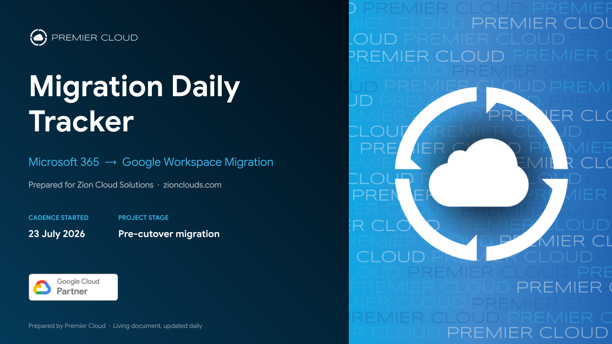
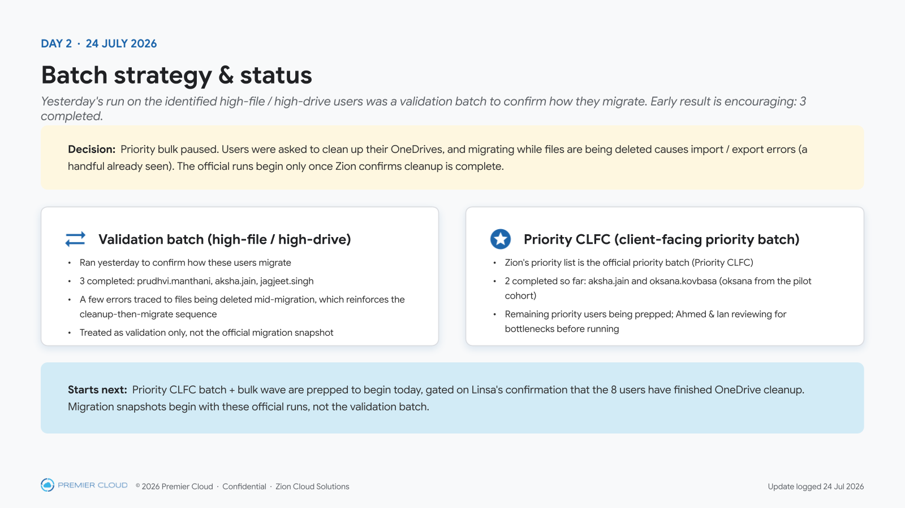
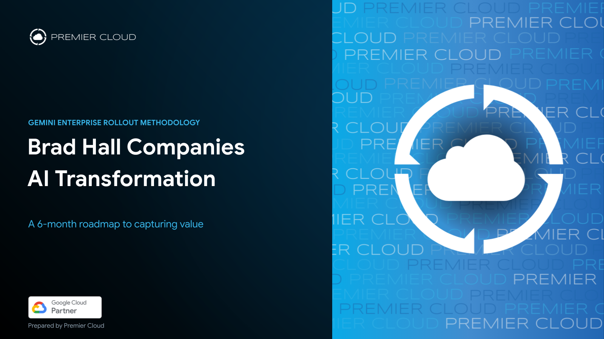
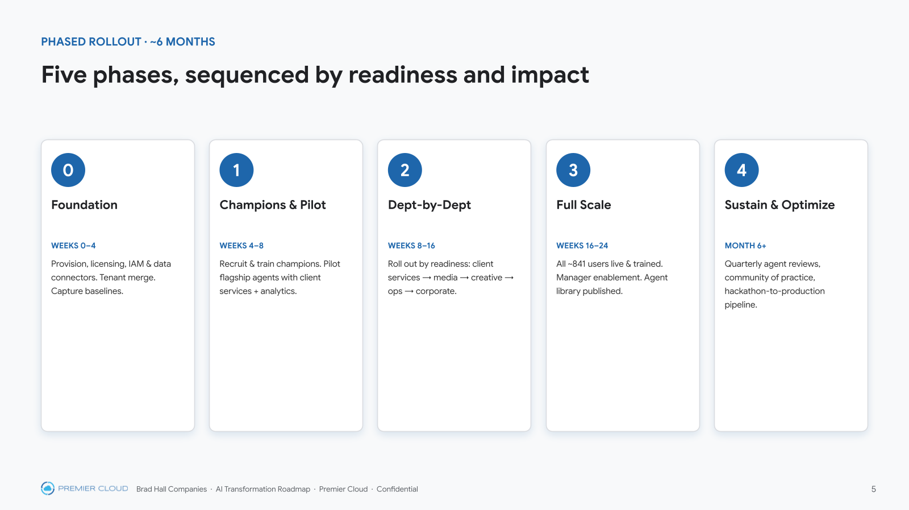
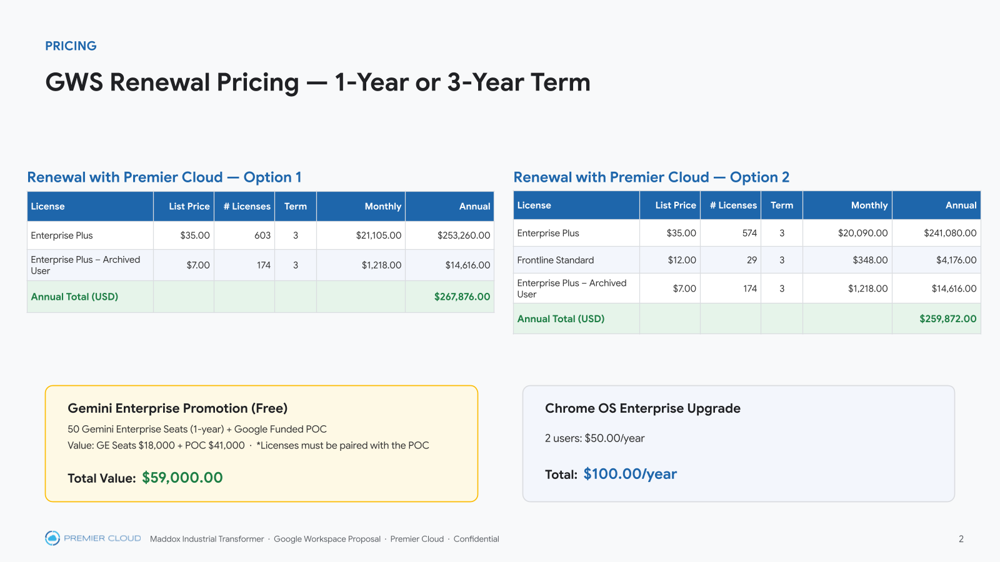
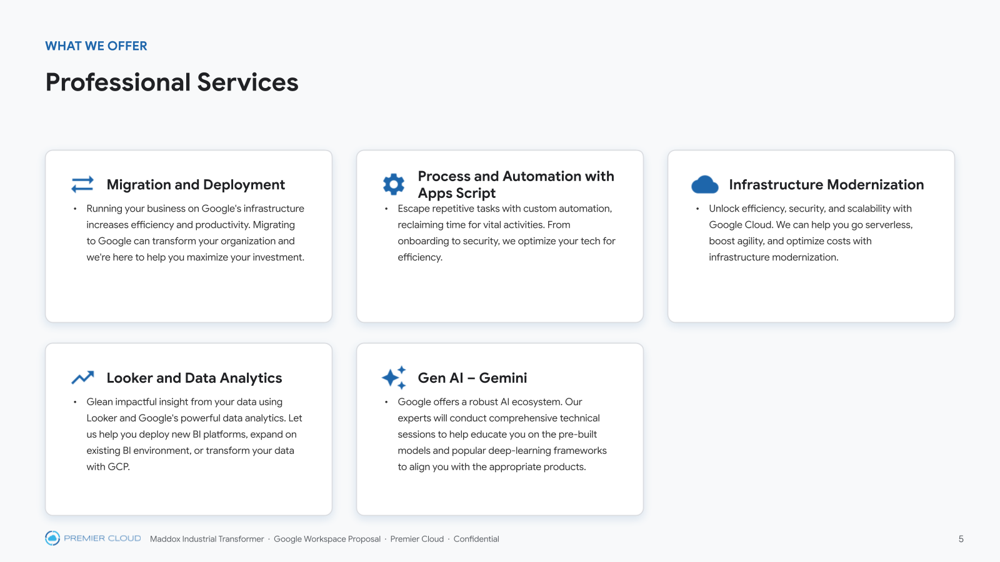
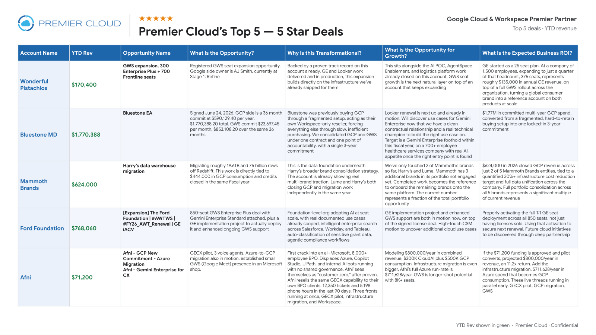
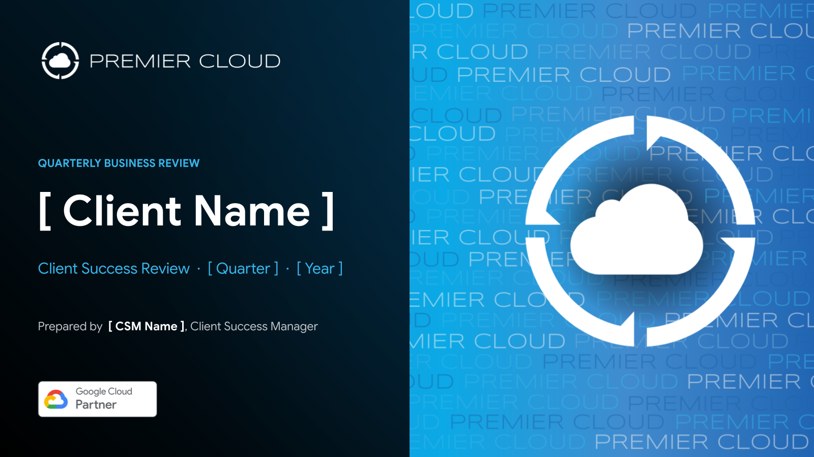

# Premier Cloud Design System

The single source of truth for Premier Cloud's visual identity — colors, typography, logo rules,
layout patterns, real brand assets, and the build pipeline used to produce on-brand materials
(slide decks, one-pagers, QBRs, proposals, reports). This repo is designed to be used by **both
humans and Claude**: it doubles as an installable Claude Skill (`premier-cloud-style`).

Premier Cloud is a Google Cloud & Workspace Premier Partner. The brand is **derived from Google
Cloud but has its own identity** — lead with Premier's blues, not generic Google `#4285F4`.

## What's in here

```
premier-cloud-design-system/
├── docs/
│   ├── brand-guidelines.md     — the authoritative, in-depth brand spec (start here)
│   └── build-pipeline.md       — how to build/rebrand materials (Drive asset IDs, gws, pptxgenjs)
├── tokens/
│   ├── colors.json             — color palette as design tokens
│   ├── colors.css              — the same palette as CSS custom properties
│   └── typography.json         — type scale, font rules, color conventions
├── assets/
│   ├── logos/                  — real Premier Cloud logo files (color, white, stacked)
│   ├── badges/                 — Google Cloud Partner badge
│   ├── covers/                 — the signature title-cover watermark banner
│   └── gradients/               — generated brand gradient/panel PNGs
├── scripts/
│   ├── gen_gradients.py        — regenerate gradient/panel PNGs (Pillow)
│   └── gen_icons.js            — generate Material icons in brand colors (react-icons + sharp)
├── examples/
│   └── screenshots/            — real slides built with this system (see below)
└── skill/                      — the packaged Claude Skill — copy into ~/.claude/skills/ to install
```

## Quick start

**Using the colors/type in a web or app project:**
```html
<link rel="stylesheet" href="tokens/colors.css">
```
```css
.cta-button { background: var(--pc-deep-blue); font-family: var(--pc-font); }
```

**Using this with Claude / Claude Code:**
```bash
cp -R skill ~/.claude/skills/premier-cloud-style
```
Then just ask Claude to build or rebrand something for Premier Cloud — the skill loads the brand
rules and build pipeline automatically. See `skill/SKILL.md` for what it covers.

**Building materials by hand:** read `docs/brand-guidelines.md` first, then `docs/build-pipeline.md`
for the exact commands (Drive asset IDs, `gws` CLI, pptxgenjs gotchas, Slides upload + QA loop).

## The brand in one screen

- **Colors:** primary Deep Blue `#1E66AB`, secondary Sky `#38B4E7`, canvas `#F8F9FA`. Green
  `#34A853` only for positive/pricing figures. The Google four-color set is a small accent only —
  never the dominant identity, never scattered per-card dots.
- **Gradients:** dark hero `#033552 → #000000`; blue `#38B4E7 → #1E66AB`.
- **Fonts:** Google Sans for everything; Syncopate for the logo lockup only; Arial is the sole
  technical fallback.
- **Logo:** one Premier Cloud logo per page, never two. Dark background → white logo; light
  background → full-color logo.
- **Signature cover:** every deck title carries the blue "PREMIER CLOUD" watermark banner
  (`assets/covers/title-cover-banner.png`) on the right ~45% of the slide, regardless of topic.

Full detail, rationale, and every hex value: [`docs/brand-guidelines.md`](docs/brand-guidelines.md).

## Examples

Real output built with this system (click through to compare against the tokens above):

| | |
|---|---|
|  |  |
|  |  |
|  |  |
|  |  |

## Design principles

1. **Lead with Premier blue, not Google blue.** `#1E66AB` is the primary identity color.
2. **One logo per page.** Never stack the Premier Cloud logo with itself; the Google Cloud Partner
   badge is a separate mark and may sit alongside it.
3. **The cover banner is non-negotiable.** Every deck title carries it — it's what makes a deck
   read as Premier Cloud at a glance, independent of topic.
4. **Card markers are single deep-blue icons**, chosen to fit the content — never the Google
   four-color dots as decoration.
5. **Rebrand means rebuild.** A pure recolor/refont of an already blue-ish deck rarely reads as
   on-brand. Rebuild the layout in this system's vocabulary unless a user explicitly asks to
   preserve an existing layout.
6. **Verify by rendering the real output.** Don't trust a generated file blind — render the
   converted Google Slides and look at every slide before calling it done.

## Contributing / updating

The guidelines file is the single source of truth. If the brand changes:
1. Edit `docs/brand-guidelines.md`.
2. Copy it into `skill/references/brand-guidelines.md` (keep them in sync).
3. Regenerate assets if colors changed: `python3 scripts/gen_gradients.py assets/gradients`.
4. Re-package the skill if you want the `.skill` install file updated.
